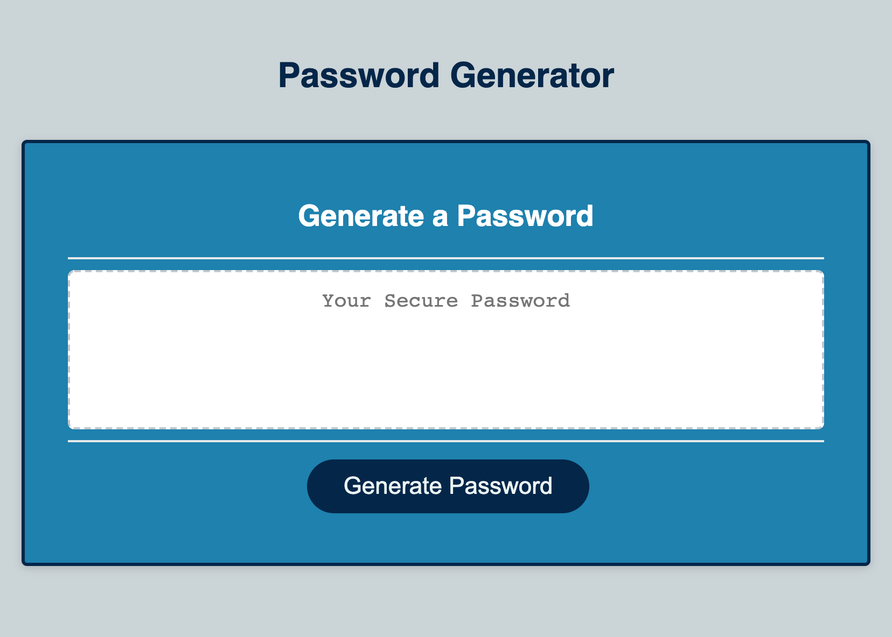

# password-generator
Random Password Generator

This project called for the creation of a random password generator that could be used to generate a secure password based on criteria choosen by the user.

The application has a simple, responsive interface with a single button for the user to click to generate a password. Upon clicking the button, a prompt box will ask the user to enter the desired password length (between 8 and 128 characters) followed by a series of confirm boxes to choose the character types to include (options are lowecase, uppercase, numbers and special characters). Once the user has chosen the desired criteria, the application will validate the input (make sure that a number has been entered for the length prompt and that it is between 8 and 128 characters, atleast one character types has been entered). 

Once valid input has been entered, the application will generate a random password that includes all the character types chosen by the user. The generated password will be displayed in the text box on the page. 

For the creation of this application, very simple html and css was used and all the actual functionality of the app was achieved through the use of Javascript. I realized early on that there were multiple ways to achieve the desired result therefore I endeavored to get the result I wanted using the simplest and cleanest code I could.

The finished application has the following UI:

The GitHub repository of the application can be found at the following link:

https://github.com/nidaqg/password-generator 

The deployed application can be found at the following link:

https://nidaqg.github.io/password-generator/ 

